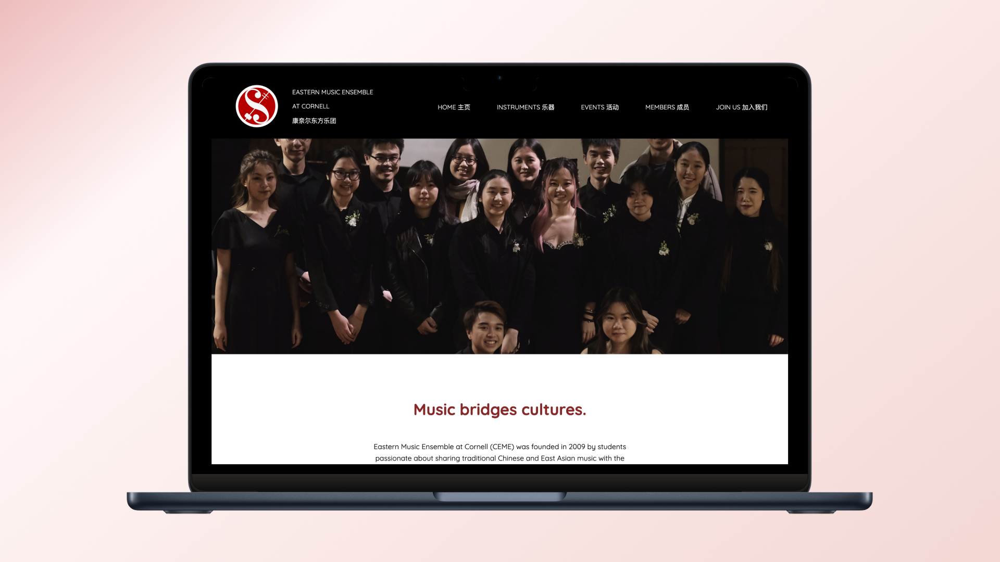

# Cornell Eastern Music Ensemble

For our INFO 1300 Introduction to Web Design and Programming group project, my group members and I designed an accessible and responsive website for our client, the Cornell Eastern Music Ensemble. 

About the Client: The Cornell Eastern Music Ensemble (CEME) is a student-run music ensemble at Cornell that celebrates the rich cultural heritage of East Asian culture. Based on a traditional Chinese orchestra, CEME showcases its Chinese origins with traditional Chinese instruments. While rooted in Chinese origins, we embrace all forms of East Asian musical genres, both old and new, and even Eastern-Western music fusion. On campus, we aim to promote a wider awareness and deeper appreciation of Asian culture through performances and outreach programs. Overall, we want to create a space where music lovers can explore and experience the musical heritage of East Asia. 

Audience Goals: The website aims to cater to people, especially music lovers, who are interested in learning more about our club, specifically, Cornell students and faculty members who are enthusiastic about exploring diverse cultural experiences through music. CEME hope that the visitors can learn more about our presence and involvement at Cornell for cultural diversity as well as learn more about Eastern music culture, and heritage. 

Our Design and Interactivity Choices: Chinese calligraphy, royal blue minimalistic theme, accordion, carousel, hamburger menu, modal

Group Members: Carrie Kim, Juan de Maqua, Nana Darko

Below are the files needed other than the web files to access our project.

| Title  | Description |
| ------------- | ------------- |
|[**Published Website**](https://ashleyh859.github.io/cemewebsite/)|Published Website|
|[Design Journey](https://github.com/ashleyh859/cemewebsite/blob/main/design-plan/design-journey.md)|Written Responses of our Design Choices|

_Note: I duplicated a new repository so this project is accessible publicly._
